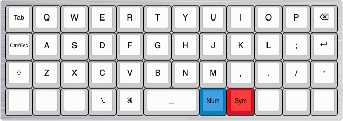
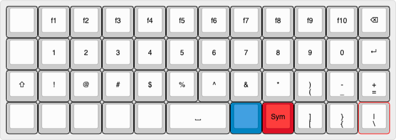

# My planck layout config

layout for my [planck keyboard](https://drop.com/buy/planck-mechanical-keyboard).

TODO:

- MacOS support
- better access for most used keys (tab, ctrl, shift, esc, option, command)
- better access for `( { [ ] } ) / ; ' "`
- Game support layout? (FPS, lol, Genshin Impact)

All layout images where created using [keyboard-layout-editor.com](http://www.keyboard-layout-editor.com/).

## Build

## Base layout (QWERTY)

trying to handle ctrl/esc

## Symbol / Number layout

## Navigation layout

## Adjust layout

## Game layout
